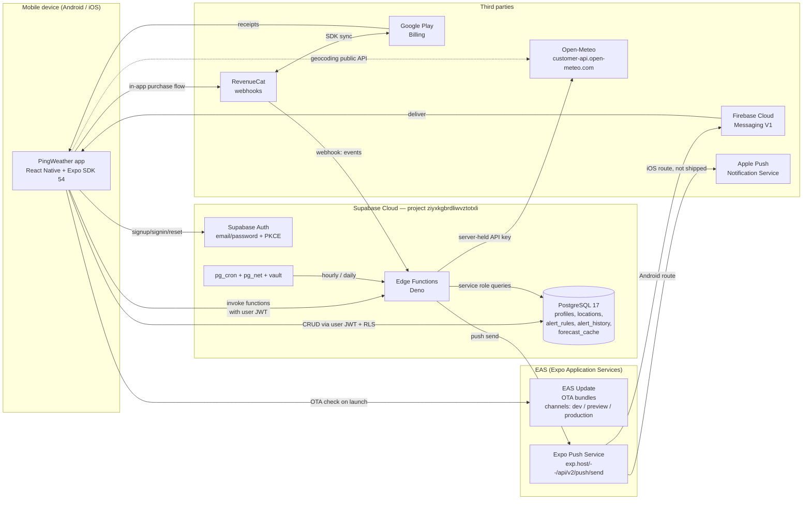
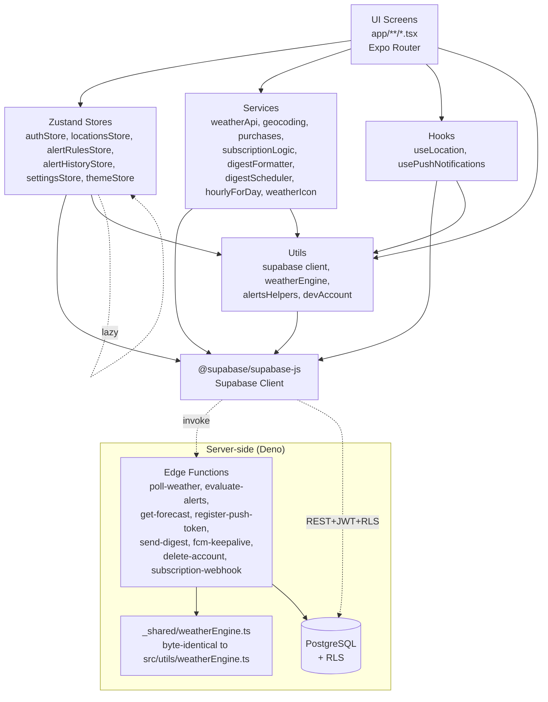
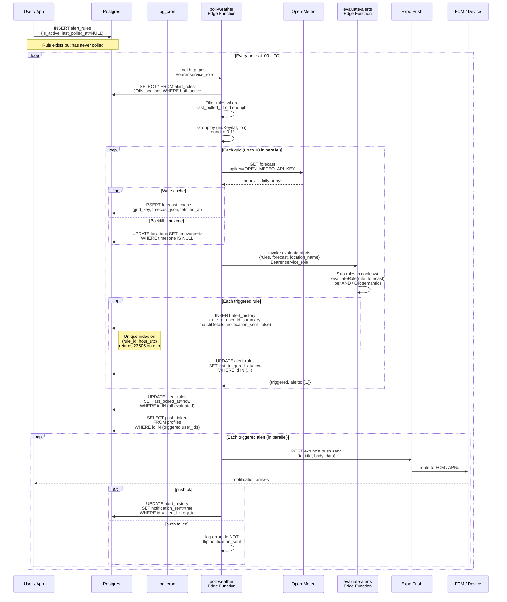
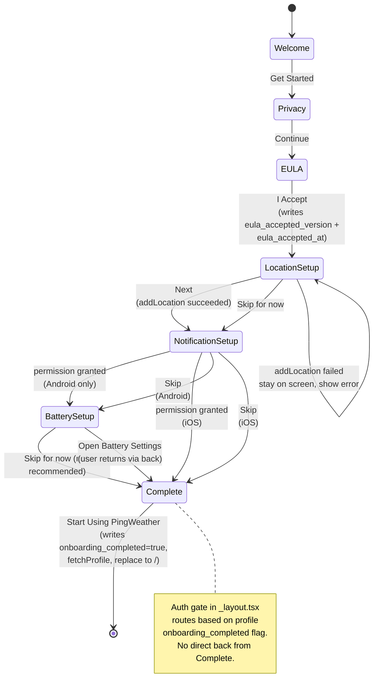
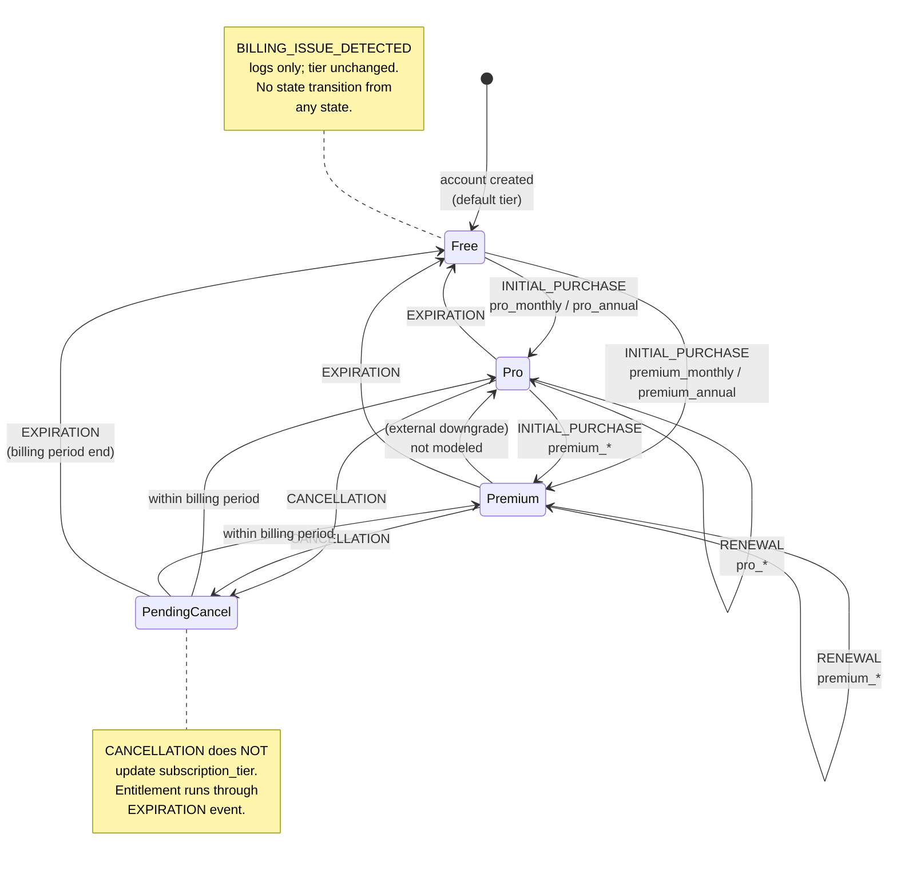

# PingWeather — Architecture Diagrams

All diagrams are Mermaid blocks. They should render as-is in any Mermaid-aware Markdown viewer (GitHub, VS Code with Mermaid extension, Mermaid Live Editor).

---

## 1. Physical deployment diagram

Which components run where, and what talks to what over the network.



---

## 2. Logical layer diagram

The client-side layer stack and what each layer depends on.



Notes:
- The dashed "lazy" arrow between Stores represents `authStore.fetchProfile()` dynamically importing `settingsStore` to avoid circular dependency (documented in code).
- Services have no UI deps — pure modules importable from tests without React.
- The `_shared/weatherEngine.ts` file is duplicated on disk by design so both Deno and Jest can import it via their respective resolvers.

---

## 3. Alert lifecycle flow

End-to-end trace from rule creation to push arriving on the device.



---

## 4. Database ERD

Tables, columns, and foreign keys.

```mermaid
erDiagram
    AUTH_USERS ||--|| PROFILES : "1:1 via id FK"
    PROFILES ||--o{ LOCATIONS : "user_id FK"
    PROFILES ||--o{ ALERT_RULES : "user_id FK"
    PROFILES ||--o{ ALERT_HISTORY : "user_id FK"
    PROFILES }o--|| LOCATIONS : "digest_location_id FK<br/>ON DELETE SET NULL"
    LOCATIONS ||--o{ ALERT_RULES : "location_id FK"
    ALERT_RULES ||--o{ ALERT_HISTORY : "rule_id FK<br/>ON DELETE SET NULL"
    FORECAST_CACHE {
        text grid_key PK
        double precision latitude
        double precision longitude
        jsonb forecast_json
        timestamptz fetched_at
    }

    AUTH_USERS {
        uuid id PK
        text email
        text encrypted_password
    }

    PROFILES {
        uuid id PK_FK
        text email
        text display_name
        text subscription_tier "free | pro | premium"
        boolean onboarding_completed
        text eula_accepted_version
        timestamptz eula_accepted_at
        text push_token
        boolean digest_enabled
        text digest_frequency "daily | weekly"
        integer digest_hour "0-23"
        integer digest_day_of_week "1-7 ISO"
        uuid digest_location_id FK
        timestamptz digest_last_sent_at
        text temperature_unit "fahrenheit | celsius"
        timestamptz created_at
        timestamptz updated_at
    }

    LOCATIONS {
        uuid id PK
        uuid user_id FK
        text name
        double latitude "-90..90"
        double longitude "-180..180"
        boolean is_active
        boolean is_default
        text timezone "IANA or NULL"
        timestamptz created_at
    }

    ALERT_RULES {
        uuid id PK
        uuid user_id FK
        uuid location_id FK
        text name
        jsonb conditions
        text logical_operator "AND | OR"
        integer lookahead_hours "1..168"
        integer polling_interval_hours "min 1"
        integer cooldown_hours "min 1"
        boolean is_active
        timestamptz last_triggered_at
        timestamptz last_polled_at
        timestamptz created_at
        timestamptz updated_at
    }

    ALERT_HISTORY {
        uuid id PK
        uuid user_id FK
        uuid rule_id FK "nullable"
        text rule_name "snapshot"
        text location_name "snapshot"
        text conditions_met
        jsonb forecast_data
        timestamptz triggered_at
        boolean notification_sent
    }
```

Notes:
- `forecast_cache` has no FK relationships (standalone lookup table keyed by gridded coords).
- ON DELETE CASCADE: profiles → locations/alert_rules/alert_history, auth.users → profiles.
- ON DELETE SET NULL: alert_rules.id → alert_history.rule_id, locations.id → profiles.digest_location_id.
- Unique partial index `idx_locations_one_default_per_user` on `(user_id) WHERE is_default`.
- Unique partial index `idx_alert_history_dedup` on `(rule_id, triggered_at_hour_utc) WHERE rule_id IS NOT NULL`.

---

## 5. Onboarding state machine



---

## 6. Subscription tier state machine

Tier transitions driven by RevenueCat webhook events.



---

## 7. Store dependency graph

Which Zustand stores depend on which, and which depend on auth state.

```mermaid
graph TD
    Auth[authStore<br/>session, user, profile<br/>NOT persisted]
    Locations[locationsStore<br/>locations[]<br/>persisted: locations]
    Rules[alertRulesStore<br/>rules[]<br/>persisted: rules]
    History[alertHistoryStore<br/>entries[]<br/>NOT persisted]
    Settings[settingsStore<br/>temperatureUnit, windSpeedUnit,<br/>notificationsEnabled<br/>persisted]
    Theme[themeStore<br/>themeName, tokens<br/>persisted: themeName]

    Auth -. lazy import in fetchProfile<br/>to seed unit pref .-> Settings

    Locations --> Auth
    Locations --> Types["TIER_LIMITS<br/>(src/types)"]

    Rules --> Auth
    Rules --> Types

    History --> Auth

    Settings -.independent.-> NoDeps1[ ]
    Theme -.independent.-> NoDeps2[ ]

    style Auth fill:#1E3A5F,color:#fff
    style Theme fill:#5B7A99,color:#fff
    style Settings fill:#5B7A99,color:#fff
    style NoDeps1 fill:#fff,stroke-width:0px
    style NoDeps2 fill:#fff,stroke-width:0px

    classDef depAuth fill:#e8eef4
    class Locations,Rules,History depAuth
```

Notes:
- Three stores (`locationsStore`, `alertRulesStore`, `alertHistoryStore`) read `authStore.user.id` or `authStore.profile.subscription_tier` to scope / gate their operations.
- `settingsStore` and `themeStore` are independent of auth — they're device-level preferences. `authStore.fetchProfile` writes into `settingsStore` as a one-way seed, which is why the arrow is dashed and unidirectional.
- No store imports any other store at module load time — the auth-to-settings link uses a dynamic `import()` inside `fetchProfile` to break the circular graph.
